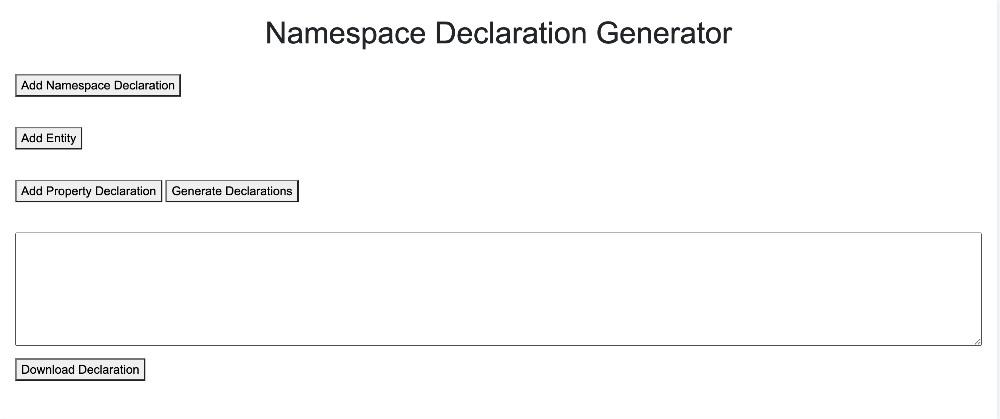

<a name="readme-top"></a>

[![Contributors][contributors-shield]][contributors-url]
[![Forks][forks-shield]][forks-url]
[![Stargazers][stars-shield]][stars-url]
[![Issues][issues-shield]][issues-url]
[![MIT License][license-shield]][license-url]
[![LinkedIn][linkedin-shield]][linkedin-url]

<!-- PROJECT LOGO -->
<br />
<div align="center">
  <a href="https://github.com/farzad-845/watdiv-gen">
    
  </a>
</div>


<!-- TABLE OF CONTENTS -->
<details>
  <summary>Table of Contents</summary>
  <ol>
    <li>
      <a href="#about-the-project">About The Project</a>
      <ul>
        <li><a href="#built-with">Built With</a></li>
      </ul>
    </li>
    <li><a href="#license">License</a></li>
  </ol>
</details>


<!-- ABOUT THE PROJECT -->
## About The Project
**[WatDiv](https://dsg.uwaterloo.ca/watdiv/)** Dataset Generator is a web application that allows users to create their own test databases or customize existing ones based on the Waterloo SPARQL Diversity Test Suite (WatDiv) v0.6. It follows the rules of the WatDiv Dataset Description Language Tutorial.

## Project Structure

### Main Structure
```bash
WatDiv-Gen
├── watdiv_api (django app)
│   ├── _base (settings of django app)
│   ├── static
│   ├── watdiv
│   ├── Dockerfile
├── watdiv_frontend
│   ├── index.html
│   ├── script.js
│   ├── styles.css
├── README.md

```

### Components Schema
<div align="center">
  <a href="https://github.com/farzad-845/watdiv-gen">
    
  </a>
</div>


---
## How to run
### Docker
This command will build the image and run the container
```bash
docker-compose up --build
```
---
## Usage
### Creating a Dataset

- Follow the WatDiv Dataset Description Language Tutorial to create a valid dataset description file.

- Use the WatDiv Dataset Generator web application to upload your dataset description file.

- The application will use WatDiv v0.6 to generate a dataset based on your description.

### Customizing an Existing Dataset

- Upload an existing WatDiv dataset file to the application.

- Specify customization details as per the WatDiv Dataset Description Language.

- Generate the customized dataset.

### Generating Queries

- Upload a WatDiv dataset file.

- Generate queries for the dataset.

### Dataset and Query Output

The generated datasets and queries will be available for download in gz format. Use the provided links to download the output files.
Contributing

---
### Built With

[![Django][Django]][Django-url]
[![Celery][Celery]][Celery-url]
[![Docker][Docker]][Docker-url]
[![RabbitMQ][RabbitMQ]][RabbitMQ-url]


<p align="right">(<a href="#readme-top">back to top</a>)</p>

#### Contributors
- Farzad Shami

<!-- LICENSE -->
## License

Distributed under the MIT License. See `LICENSE.txt` for more information.

<p align="right">(<a href="#readme-top">back to top</a>)</p>

<!-- MARKDOWN LINKS & IMAGES -->
<!-- https://www.markdownguide.org/basic-syntax/#reference-style-links -->
[contributors-shield]: https://img.shields.io/github/contributors/farzad-845/watdiv-gen.svg?style=for-the-badge
[contributors-url]: https://github.com/farzad-845/watdiv-gen/graphs/contributors
[forks-shield]: https://img.shields.io/github/forks/farzad-845/watdiv-gen.svg?style=for-the-badge
[forks-url]: https://github.com/farzad-845/watdiv-gen/network/members
[stars-shield]: https://img.shields.io/github/stars/farzad-845/watdiv-gen.svg?style=for-the-badge
[stars-url]: https://github.com/farzad-845/watdiv-gen/stargazers
[issues-shield]: https://img.shields.io/github/issues/farzad-845/watdiv-gen.svg?style=for-the-badge
[issues-url]: https://github.com/farzad-845/watdiv-gen/issues
[license-shield]: https://img.shields.io/github/license/farzad-845/watdiv-gen.svg?style=for-the-badge
[license-url]: https://github.com/farzad-845/watdiv-gen/blob/master/LICENSE.txt
[linkedin-shield]: https://img.shields.io/badge/-LinkedIn-black.svg?style=for-the-badge&logo=linkedin&colorB=555
[linkedin-url]: https://linkedin.com/in/farzad-shami
[product-screenshot]: images/screenshot.png
[Django]: https://img.shields.io/badge/Django-092E20?style=for-the-badge&logo=django&logoColor=green
[Django-url]: https://www.djangoproject.com/
[RabbitMQ]: https://img.shields.io/badge/rabbitmq-%23FF6600.svg?&style=for-the-badge&logo=rabbitmq&logoColor=white
[RabbitMQ-url]: https://rabbitmq.com/
[Docker]: https://img.shields.io/badge/docker-2496ED?style=for-the-badge&logo=docker&logoColor=white
[Docker-url]: https://www.docker.com/
[Celery]: https://img.shields.io/badge/celery-4EA94B?style=for-the-badge&logo=celery&logoColor=white
[Celery-url]: https://docs.celeryq.dev/en/stable/getting-started/backends-and-brokers/index.html

---

<p><em>Part of Database II 2023-2024 course of <a href="http://www.unipd.it">University of Padova</a></em>


